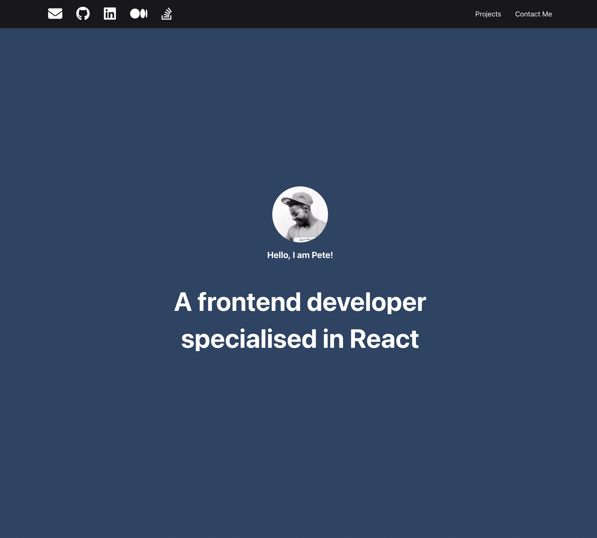
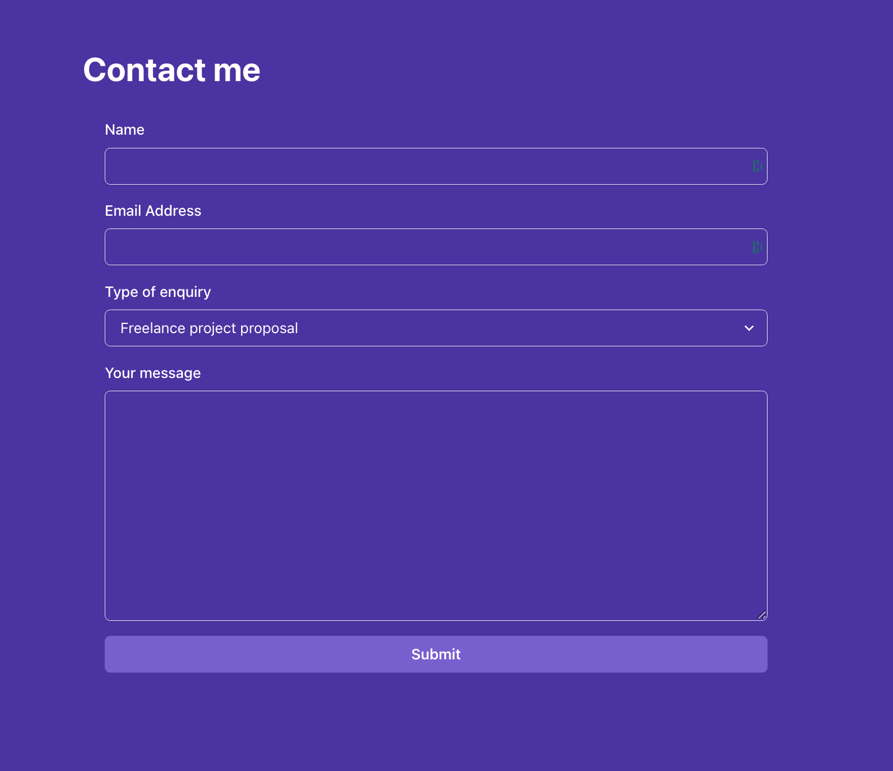

# Portfolio

This is a creative project, and the goal is to use as many React concepts as possible within this portfolio. I used 
component composition, code reusability, hooks, manage state, interact with an external API, create forms, lists and so
on.

The portfolio app that contains:

- A header with external links to social media accounts and internal links to other sections of the page.

- A landing section with an avatar picture and a short bio.

- A section to display your featured projects as cards in a grid fashion.

- A contact me section with a form to allow visitors to contact you.

## Screenshots

